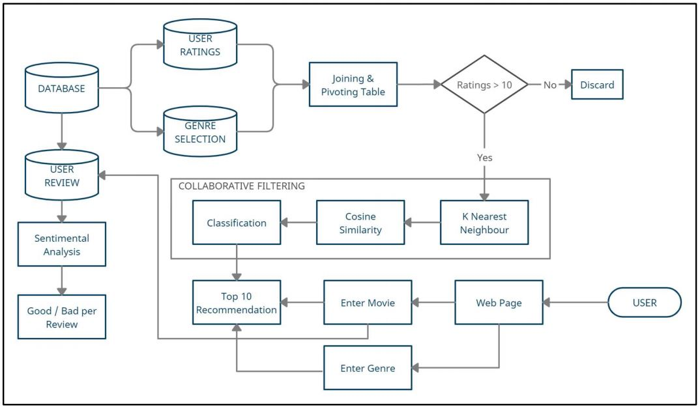

# Smart-Film-Matching-System
CineMatch is a hybrid movie recommendation system using Collaborative &amp; Content-Based Filtering with KNN &amp; Neural Networks for accurate suggestions. It recommends movies by title, genre, or genre &amp; year while applying Sentiment Analysis to user reviews. Optimized via feature selection, it enhances traditional models with added functionalities.


## CineMatch: AI-Powered Movie Recommender (Web & Notebook)  

An advanced movie recommendation system utilizing **Collaborative Filtering** (Website) and **Content-Based Filtering** (Jupyter Notebook).  

### **Objectives**  

1. Develop a movie recommendation engine using **Collaborative Filtering** and **Machine Learning** techniques like **K-Nearest Neighbors (KNN)**.  
2. Suggest movies based on the **title** provided by the user.  
3. Enable recommendations based on **genre only** or a combination of **genre and release year**.  
4. Perform **Sentiment Analysis** to categorize user reviews for each movie.  
5. Implement **Neural Networks** for **Matrix Factorization** in (**).  

To optimize deployment, **data exploration and feature selection** have been conducted on the complete dataset.  

### **Installation Guide**  
1. Open **shell/cmd** and navigate to the project directory.  
2. Activate your **virtual environment** (if applicable).  
3. Run the command:  
   ```bash
   pip install -r requirements.txt
   ```  

### **System Flow**  
<div align='center'>  
  
</div>  

### **Deployment Status**  
- All **links and features** are currently functional and can be tested live.  

### **Reference & Enhancements**  
- **Original inspiration**: [AJAX Movie Recommendation System with Sentiment Analysis](https://github.com/kishan0725/AJAX-Movie-Recommendation-System-with-Sentiment-Analysis).  
- This project extends the referenced implementation with **additional features and enhancements**.
